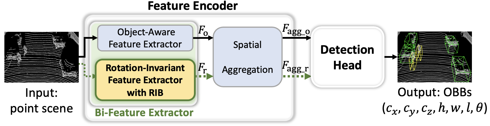
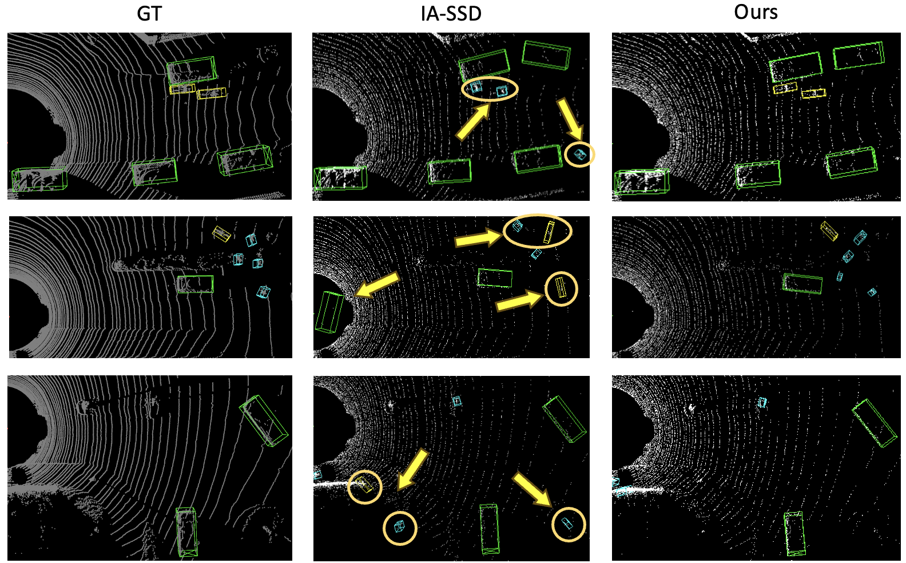

# RIDE: Boosting 3D Object Detection for LiDAR Point Clouds via Rotation-Invariant Analysis

by Zhaoxuan Wang, Xu Han, Hongxin Liu, and Xianzhi Li <br>
in _IEEE Transactions on Intelligent Transportation Systems_ [[page]](https://ieeexplore.ieee.org/document/11536878)

# Introduction
The official implementation of the paper entitled **RIDE: Boosting 3D Object Detection for LiDAR Point Clouds via Rotation-Invariant Analysis** in IEEE Transactions on Intelligent Transportation Systems (IEEE T-ITS). <br>

In this paper, we present RIDE, a plug-and-play 3D point-based detector modular incorporating rotation-invariance feature representation. To our best knowledge, RIDE is the first attempt to exploit the rotation-invariant features within local geometric structure for the 3D object detection task. Specifically, we propose a bi-feature extractor with bi-set abstraction (Bi-SA) layers to extract both rotation-invariant and object-aware features, and decode the attributes of the oriented bounding boxes (OBBs) according to the characteristics of the features. RIDE can be easily integrated into the existing state-of-the-art one-stage and two-stage detectors, and extensive experiments on the benchmarks showcase that our method can significantly improve both performance and rotation robustness simultaneously.

<div align=center>
    
</div>

<div align=center>
    
</div>

## Environment
- PyTorch = 1.8.1<br>
- CUDA = 11.1<br>
- Python = 3.8<br>
- Ubuntu = 20.04<br>
- pcdet = 0.5.2
- spconv = 2.1.25-cu111

## Prerequisites
### Install SparseConv
The SparseConv library is required by OpenPCDet,  to install the `spconv 2.1.25-cu111`, please see the [official document](https://github.com/traveller59/spconv).

### Install OpenPCDet
Our framework is supported by the official [OpenPCDet](https://github.com/open-mmlab/OpenPCDet) toolbox, to install the `pcdet v0.5.2`, please run the following command:
```
python setup.py develop
```

### Dataset Preparation
- #### KITTI Dataset
Please download the [official KITTI dataset](https://www.cvlibs.net/datasets/kitti/eval_object.php?obj_benchmark=3d) (**w/o plane data**), and organize the files as:
```
  ├── data
  │   ├── kitti
  │   │   │── ImageSets
  │   │   │── training
  │   │   │   ├──calib & velodyne & label_2 & image_2
  │   │   │── testing
  │   │   │   ├──calib & velodyne & image_2
  ├── pcdet
  ├── tools
```
Generate the data infos by running the following command:
```
python -m pcdet.datasets.kitti.kitti_dataset create_kitti_infos tools/cfgs/dataset_configs/kitti_dataset.yaml
```

- #### nuScenes Dataset
Please download the [official nuScenes dataset](https://www.nuscenes.org/download), and organize the files as:
```
  ├── data
  │   ├── nuscenes
  │   │   │── v1.0-trainval
  │   │   │   │── samples
  │   │   │   │── sweeps
  │   │   │   │── maps
  │   │   │   │── v1.0-trainval  
  ├── pcdet
  ├── tools
```
Install the `nuscenes-devkit` with version `1.0.5` by running the following command:
```
pip install nuscenes-devkit==1.0.5
```
Generate the data infos by running the following command (it may take several hours):
```
python -m pcdet.datasets.nuscenes.nuscenes_dataset --func create_nuscenes_infos \
    --cfg_file tools/cfgs/dataset_configs/nuscenes_dataset.yaml \
    --version v1.0-trainval
```

## Training & Testing
To train a model, please run the following command:
```
# Single GPU
python train.py --cfg_file ${CONFIG_FILE}

# Multiple GPUs
sh scripts/dist_train.sh ${NUM_GPUS} --cfg_file ${CONFIG_FILE}
```
We provide the pre-trained [IA-SSD](https://drive.google.com/file/d/1W3039m-M4wJghH3MiEudMtXnfUhd1UAU/view?usp=sharing) model on KITTI.

To test a trained model, please run the following command:
```
python test.py --cfg_file ${CONFIG_FILE} --batch_size ${BATCH_SIZE} --ckpt ${CKPT}
```
**NOTE: To test the _NR_ case, please uncomment line 49: `noise_rotation = 0.` in `pcdet/utils/rot_utils.py`; comment out for _AR_ case.**


